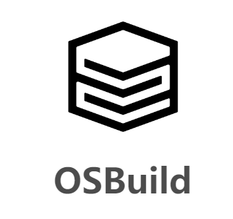
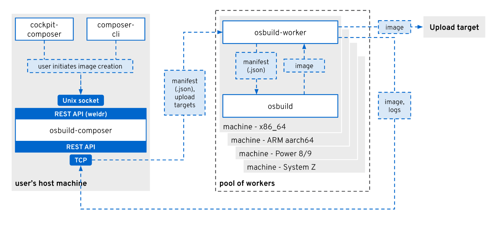

# osbuild



```
Something I hope you know before go into the coding~
First, please watch or star this repo, I'll be more happy if you follow me.
Bug report, questions and discussion are welcome, you can post an issue or pull a request.
```


## 相关站点

* 官方源码：<https://github.com/osbuild/osbuild>
* 官方文档：<https://www.osbuild.org/guides/>


## 目录


* [osbuild介绍](docs/osbuild介绍.md)
* [osbuild部署](docs/osbuild部署.md)
* [osbuild核心概念](docs/osbuild核心概念.md)


## 图示




---
