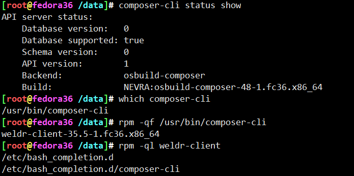
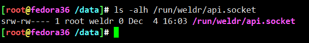
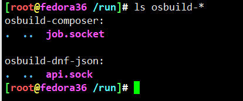
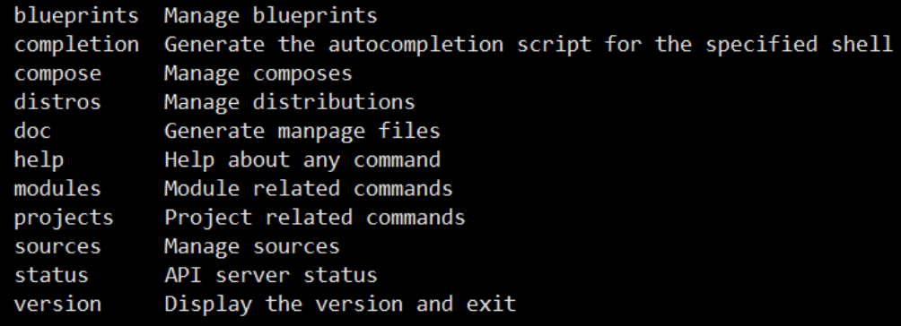
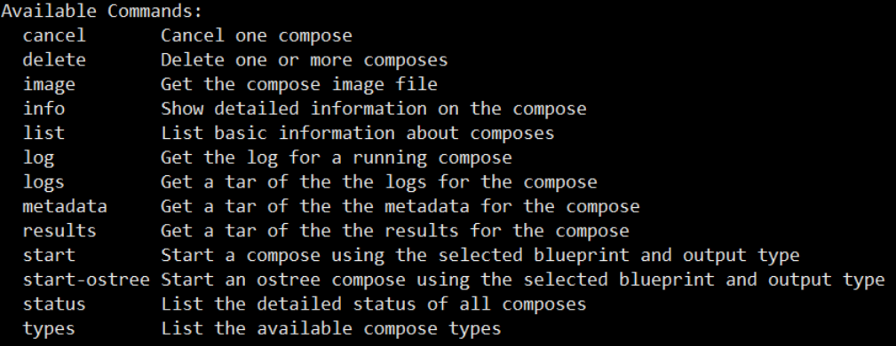
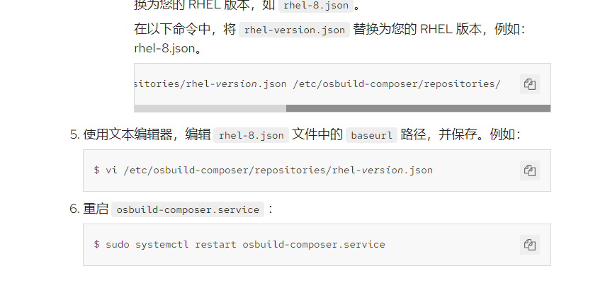
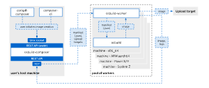
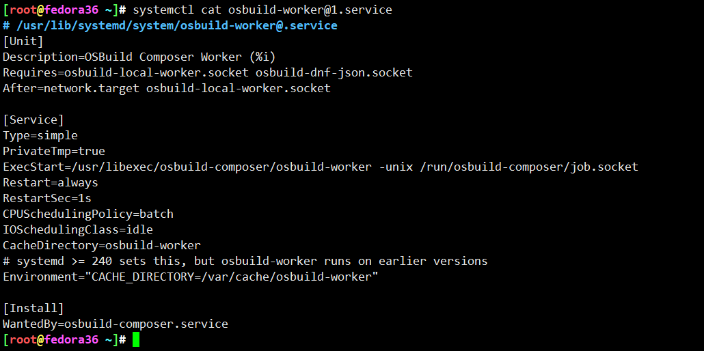

# osbuild命令片段


```

dnf install osbuild-composer composer-cli cockpit-composer

systemctl enable --now osbuild-composer.socket cockpit.socket

composer-cli status show

$ sudo usermod -a -G weldr yifengyou
$ newgrp weldr


composer-cli sources add source.toml
composer-cli sources list


composer-cli blueprints push blueprint.toml
composer-cli blueprints list
composer-cli blueprints show base-image-with-tmux
composer-cli compose start base-image-with-tmux qcow2
composer-cli compose info ab71b61a-b3c4-434f-b214-1e16527766ff

composer-cli compose help


composer-cli compose status
composer-cli compose log 01424fc5-f66e-486a-8f0c-38aa06a4f4fd
composer-cli compose types


将蓝图推送到镜像构建器服务器：

# composer-cli blueprints push blueprint-name.toml
列出现有的蓝图，以检查创建的蓝图是否已成功推送并存在。

# composer-cli blueprints show BLUEPRINT-NAME
检查蓝图中列出的组件和版本是否有效：

# composer-cli blueprints depsolve blueprint-name

composer-cli compose start blueprint-name image-type
# composer-cli compose status
<UUID> RUNNING date blueprint-name blueprint-version image-type
# composer-cli compose cancel <UUID>
# composer-cli compose delete <UUID>
# composer-cli compose start-ostree --ref rhel/8/x86_64/edge --parent parent-OSTree-commit-id blueprint-name image-type
# composer-cli compose image <UUID>
$ <UUID>-commit.tar: size MB


composer-cli sources add epel.ini
composer-cli sources list


composer-cli compose start centos9 ami --size=4096

# composer-cli compose image ca57fd64-11ea-41d4-b924-9b8f5bdcaf5e
ca57fd64-11ea-41d4-b924-9b8f5bdcaf5e-image.raw
# ls -alh ca57fd64-11ea-41d4-b924-9b8f5bdcaf5e-image.raw
-rw-------. 1 root root 2.7G May  6 16:20 ca57fd64-11ea-41d4-b924-9b8f5bdcaf5e-image.raw

$ sudo journalctl -af -u osbuild-worker@1.service


```


---








* /run/osbuild-composer/job.socket
* /run/osbuild-dnf-json/api.socket
* /run/weldr/api.socket

* <https://weldr.io/lorax/lorax-composer/lorax-composer.html>
* <https://weldr.io/lorax/composer-cli.html>







```
name = "base"
description = "A base system with bash"
version = "0.0.1"

[[packages]]
name = "htop"
version = "*"

[[packages]]
name = "vim"

[[packages]]
name = "htop"

[[packages]]
name = "tmux"
version = "*"


[[packages]]
name = "iproute"
version = "*"


[customizations.kernel]
append = "nosmt=force"


[[customizations.user]]
name = "admin"
description = "Administrator account"
password = "$6$CHO2$3rN8eviE2t50lmVyBYihTgVRHcaecmeCk31L..."
key = "PUBLIC SSH KEY"
home = "/srv/widget/"
shell = "/usr/bin/bash"
groups = ["widget", "users", "wheel"]
uid = 1200
gid = 1200

[customizations.timezone]
timezone = "Asia/Shanghai"
ntpservers = ["0.north-america.pool.ntp.org", "1.north-america.pool.ntp.org"]

[customizations.locale]
languages = ["en_US.UTF-8"]
keyboard = "us"

```

表格数组中，一对[]表示对象，[[]]双方括号表示数组对象


* <https://access.redhat.com/documentation/zh-cn/red_hat_enterprise_linux/8/html-single/composing_installing_and_managing_rhel_for_edge_images/index>




* <https://major.io/2022/05/06/build-a-custom-centos-stream-9-cloud-image/>







```
lorax -p Fedora -v 36 -r 36 \
-s http://mirrors.aliyun.com/fedora/releases/36/Everything/x86_64/os/ \
./results/
setenforce 1


http://mirrors.aliyun.com/fedora/releases/36/Everything/x86_64/os/
```


---
